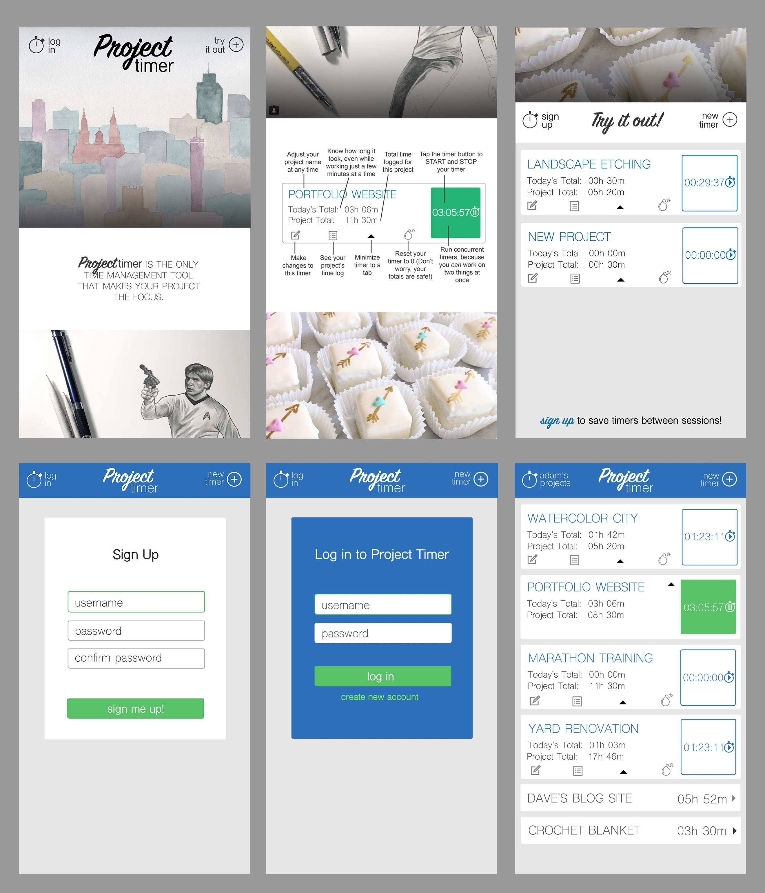

# Project Timer

Project Timer will let users create and save as many customized timers as they need to time their personal projects.

## Technologies Used

Project Timer mainly employs HTML, CSS, and JavaScript, with jQuery, NodeJS server files, an online Mongo database, and authentication with JavaScript Web Tokens. The project also uses images created in Adobe Illustrator and Photoshop.

