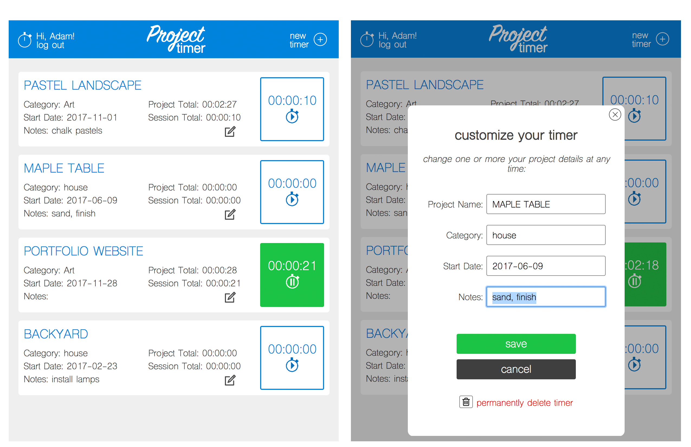

# Project Timer

Project Timer allows users to create and save as many customized timers as they need to time their personal projects.

[See the Project Timer site and try the demo.](https://project-timer-app.herokuapp.com/)

## Technologies Used

Project Timer mainly employs HTML, CSS, and JavaScript, with jQuery, NodeJS server files, an online Mongo database, Mocha integration tests, Heroku deployment, and user authentication with JavaScript Web Tokens. The project also uses images created in Adobe Illustrator and Photoshop.

